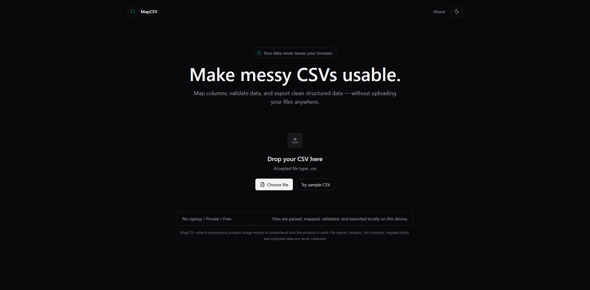
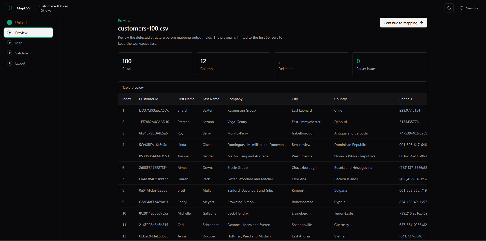
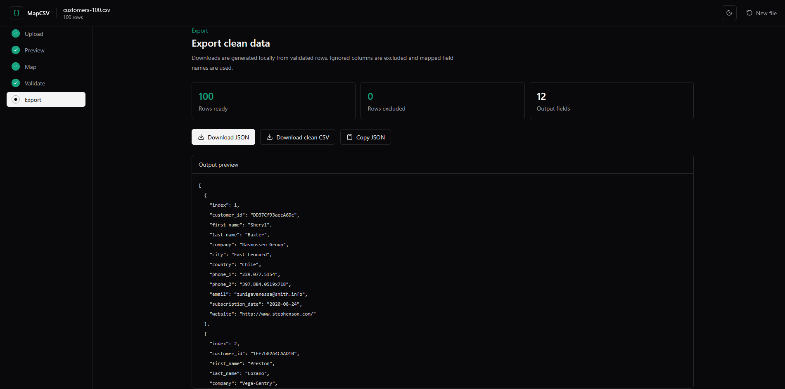

# MapCSV

**Make messy CSVs usable.**

MapCSV helps you map columns, validate data, and export clean CSV or JSON directly in your browser.

CSV data stays in your browser. No signup required.

[](LICENSE)


## Try MapCSV

[Open MapCSV ->](https://mapcsv.saidislom0613.workers.dev)

## MapCSV in Action







## How It Works

MapCSV follows a simple local-first workflow:

```text
Upload -> Preview -> Map -> Validate -> Export
```

1. Upload a `.csv` file or try the built-in sample.
2. Preview detected columns, row count, delimiter, and parser issues.
3. Map inconsistent source columns to clean output field names.
4. Validate rows using field types and required-field rules.
5. Export valid rows as clean CSV, download JSON, or copy JSON.

## Features

- Browser-based CSV parsing with Papa Parse
- Drag-and-drop and file picker upload
- Built-in sample CSV for quick testing
- CSV preview with detected rows, columns, delimiter, and parser warnings
- Column mapping with output name, type, required, and ignore controls
- Validation for string, number, email, date, boolean, and required fields
- Duplicate output field name warnings
- Row-level validation issue table
- Clean CSV export
- JSON export
- Copy JSON to clipboard
- Light, dark, and system theme modes
- No signup
- Local-first CSV processing
- Open source under MIT

## Privacy

CSV parsing, mapping, validation, and export generation happen locally in your browser.

CSV contents and CSV-derived data are not sent to MapCSV servers. MapCSV does not collect CSV contents, filenames, headers, cell values, mapped field names, emails, phone numbers, names contained inside CSV data, exported CSV/JSON, validation values, or other CSV-derived text.

MapCSV does collect anonymous product usage events so the project can understand which parts of the workflow are being used. Those events are limited to product metadata such as event names, anonymous visitor/session IDs, app version, workflow type, export format, and basic attribution.

## Tech Stack

- React 19
- TypeScript 6
- Vite 8
- Tailwind CSS
- Papa Parse
- Zod
- Lucide React
- Cloudflare Workers with Static Assets
- Cloudflare D1
- Vitest
- ESLint

## Run Locally

Prerequisites:

- Node.js
- pnpm

Clone and run the public frontend:

```bash
git clone https://github.com/zsaidislom/mapcsv.git
cd mapcsv
pnpm install
pnpm dev
```

The basic frontend workflow does not require Cloudflare or D1. For Worker/API local testing, build first and run Wrangler:

```bash
pnpm build
pnpm wrangler dev
```

## Testing

Available checks:

```bash
pnpm test
pnpm lint
pnpm typecheck:worker
pnpm build
```

## Architecture

MapCSV is deployed as one Cloudflare Worker named `mapcsv`.

```text
Browser UI
  -> local CSV parsing, mapping, validation, export
  -> privacy-safe analytics event metadata
  -> Cloudflare Worker
  -> Cloudflare D1
```

The same Worker serves the Vite static assets and API routes:

- Static assets and SPA routes: `/`, `/admin`, JS, CSS
- Public analytics ingestion: `POST /api/events`
- Private admin API: `POST /api/admin/login`, `POST /api/admin/logout`, `GET /api/admin/summary`

CSV contents remain browser-local and are not part of the analytics flow.

## Privacy-Safe Analytics

The public app sends small anonymous events to:

```text
POST /api/events
```

The Worker validates each event, rejects unknown fields, rate-limits obvious per-session spam, and stores accepted event metadata in D1.

Allowed event names:

- `page_view`
- `sample_csv_parsed`
- `local_csv_parsed`
- `preview_opened`
- `mapping_opened`
- `validation_run`
- `export_csv`
- `export_json`
- `copy_json`

Allowed payload fields:

- `eventName`
- `visitorId`
- `sessionId`
- `appVersion`
- `workflowType`
- `exportFormat`
- `attribution.source`
- `attribution.medium`
- `attribution.campaign`
- `occurredAt`

MapCSV generates an anonymous `visitorId` in `localStorage` and a `sessionId` in `sessionStorage`. This supports approximate product metrics without accounts, fingerprinting, IP storage, or device profiling.

UTM support includes `utm_source`, `utm_medium`, and `utm_campaign`. Values are normalized and length-limited before storage.

The main product metric is:

```text
Successful exports from real CSV workflows per week
```

This is counted as unique sessions with export events where `workflowType = "local"` over the last 7 days.

## Adding Analytics Events Safely

When adding analytics, do not include CSV-derived data.

1. Add the event name to `analyticsEventNames` in `src/lib/analyticsSchema.ts`.
2. Add only non-sensitive metadata.
3. Update tests in `src/lib/*analytics*.test.ts`.
4. Search the payload path and verify no CSV-derived text can enter it.
5. Run:

```bash
pnpm test
pnpm lint
pnpm typecheck:worker
pnpm build
```

## Admin Dashboard

MapCSV includes a private analytics dashboard for product operations. It is not a public product feature.

The dashboard reads aggregated metrics from:

```text
GET /api/admin/summary?range=7d
```

Admin authentication is handled inside the Worker:

- `ADMIN_PASSWORD` is stored as a Cloudflare Worker Secret.
- `ADMIN_SESSION_SECRET` is stored as a Cloudflare Worker Secret.
- Successful login creates a signed `HttpOnly`, `Secure`, `SameSite=Strict` session cookie.
- The frontend does not store the password or session in `localStorage`.
- `GET /api/admin/summary` returns `401` without a valid session.

Set the secrets with Wrangler:

```bash
pnpm wrangler secret put ADMIN_PASSWORD
pnpm wrangler secret put ADMIN_SESSION_SECRET
```

Do not put secret values in `wrangler.toml`, source files, D1, logs, or chat messages.

For local Worker testing only, `ADMIN_DEV_BYPASS` may be set to `"true"`. Production should keep it `"false"`.

## Deployment

MapCSV uses Cloudflare Workers with Static Assets, configured in `wrangler.toml`:

```toml
name = "mapcsv"
main = "src/worker.ts"
workers_dev = true

[assets]
directory = "./dist"
binding = "ASSETS"
not_found_handling = "single-page-application"
```

The Worker expects a D1 binding named `DB`:

```toml
[[d1_databases]]
binding = "DB"
database_name = "mapcsv_analytics"
database_id = "YOUR_DATABASE_ID"
```

The first migration is:

```text
migrations/0001_analytics_events.sql
```

Apply migrations only when needed:

```bash
pnpm wrangler d1 migrations apply mapcsv_analytics --remote
```

Deploy the Worker/static-assets app:

```bash
pnpm build
pnpm wrangler deploy
```

Do not create a separate Cloudflare Pages project for this app.

## Project Structure

```text
src/
  admin/             Private analytics dashboard UI
  components/        Shared UI and navigation
  data/              Local sample CSV data
  features/          Upload, preview, mapping, validation, and export screens
  lib/               CSV, validation, export, analytics, and admin auth logic
  types/             Shared TypeScript types
  worker.ts          Cloudflare Worker API routes + static asset fallback
migrations/
  0001_analytics_events.sql
docs/images/
  Product screenshots used by this README
```

## Current Limitations

- CSV only; XLS and XLSX are not supported.
- Mapping sessions are not saved between browser sessions.
- Exports include only rows that pass validation.
- Date validation accepts ISO-style dates and dates with month names; ambiguous numeric dates are rejected.
- The analytics dashboard is intentionally small and focused on product usage metrics.

## Contributing

Issues and pull requests are welcome. If you change CSV parsing, validation, export behavior, analytics, or Worker routes, please include focused tests and run the full check suite before opening a pull request.

## License

MapCSV is licensed under the [MIT License](LICENSE).
